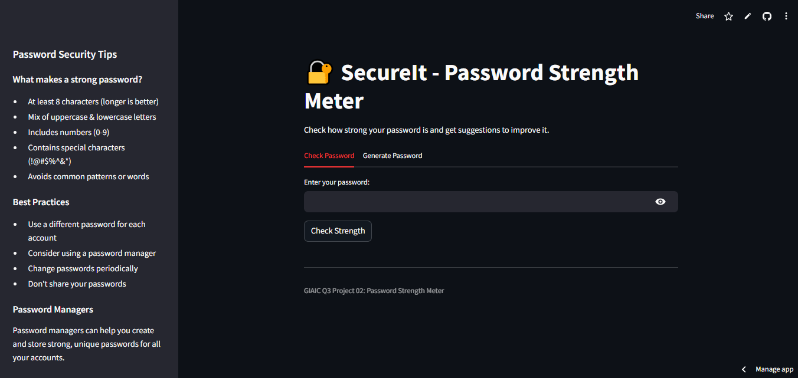

# 🔐 SecureIt - Password Strength Meter

A Python web application that analyzes password security, provides improvement feedback, and generates strong passwords. Built with Streamlit for an intuitive user interface.



## 🌟 Features

- **Password Security Analysis**: Evaluates passwords based on industry security standards
- **Interactive Strength Scoring**: Visual representation of password strength (0-5 scale)
- **Detailed Feedback**: Specific suggestions to improve weak passwords
- **Strong Password Generator**: Creates highly secure passwords with customizable length
- **Security Education**: Includes best practices and explanations of security concepts
- **Common Password Detection**: Warns users about frequently used weak passwords
- **Password Entropy Calculation**: Shows information-theoretic strength measurement
- **Modern Web Interface**: Clean, responsive design with Streamlit

## 🚀 Installation

1. Clone this repository:
   ```bash
   git clone https://github.com/yourusername/password-strength-meter.git
   cd password-strength-meter
   ```

2. Install the required dependencies:
   ```bash
   pip install -r requirements.txt
   ```

3. Run the application:
   ```bash
   streamlit run password_meter_app.py
   ```

4. Open your browser and navigate to the URL shown in the terminal (typically http://localhost:8501)

## 📋 Requirements

- Python 3.7+
- Streamlit
- Regular Expressions (re) module

## 🔍 How It Works

### Password Strength Criteria

The application evaluates passwords based on five key security criteria:

1. **Length**: Minimum of 8 characters
2. **Character Diversity**: Mix of uppercase and lowercase letters
3. **Numeric Characters**: Inclusion of at least one digit (0-9)
4. **Special Characters**: Presence of at least one special character (!@#$%^&*)
5. **Pattern Avoidance**: Absence of common patterns like "123", "abc", "password", etc.

### Scoring System

- **1-2 points**: Weak password - High risk
- **3-4 points**: Moderate password - Medium risk
- **5 points**: Strong password - Lower risk

### Password Generator

The password generator creates strong passwords by ensuring:
- Guaranteed inclusion of lowercase, uppercase, numeric, and special characters
- Random character positioning
- Configurable length (default: 12 characters)
- High entropy and resistance to common attacks

## 🧩 Code Structure

- `password_meter_app.py`: Main Streamlit application file
- `check_password_strength()`: Core function for evaluating password security
- `generate_strong_password()`: Function for creating secure passwords
- UI components: Tabs, inputs, feedback displays, and visual indicators

## 🔧 Advanced Use

### As a Module

You can import and use the core functions in your own Python projects:

```python
from password_meter_app import check_password_strength, generate_strong_password

# Check a password
score, feedback = check_password_strength("MyP@ssw0rd")
print(f"Password score: {score}/5")
for suggestion in feedback:
    print(suggestion)

# Generate a strong password
new_password = generate_strong_password(length=16)
print(f"Generated password: {new_password}")
```

### Command Line Interface

The repository also includes a CLI version for terminal usage:

```bash
python password_checker_cli.py
```

## 🛡️ Security Notes

- This tool should be used as an educational resource to understand password security
- For production environments, consider industry-standard solutions
- No passwords are stored or transmitted - all analysis happens client-side
- The entropy calculation provides an approximation of security strength

## 📚 Future Enhancements

- [ ] Add support for passphrase generation
- [ ] Implement dictionary-based weak password detection
- [ ] Create visualization of password security over time
- [ ] Add exportable password security reports
- [ ] Implement password manager integration

## 🤝 Contributing

Contributions are welcome! Please feel free to submit a Pull Request.

1. Fork the repository
2. Create your feature branch (`git checkout -b feature/amazing-feature`)
3. Commit your changes (`git commit -m 'Add some amazing feature'`)
4. Push to the branch (`git push origin feature/amazing-feature`)
5. Open a Pull Request

## 📞 Contact

Muhammad Ahsan - [@Ahsuu27488](https://github.com/Ahsuu27488) - ahsanrajput811@gmail.com

Project Link: [https://github.com/Ahsuu27488/SecureIT_Password-Strength-Meter](https://github.com/Ahsuu27488/SecureIT_Password-Strength-Meter)
